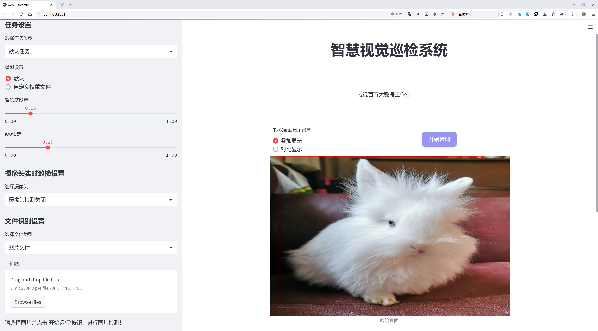
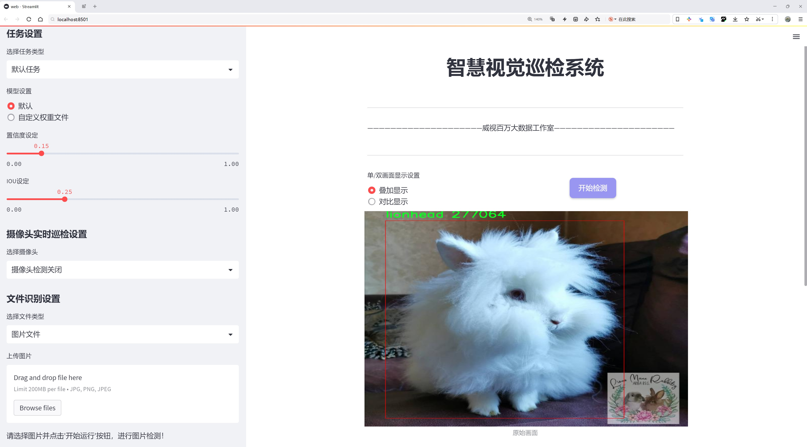
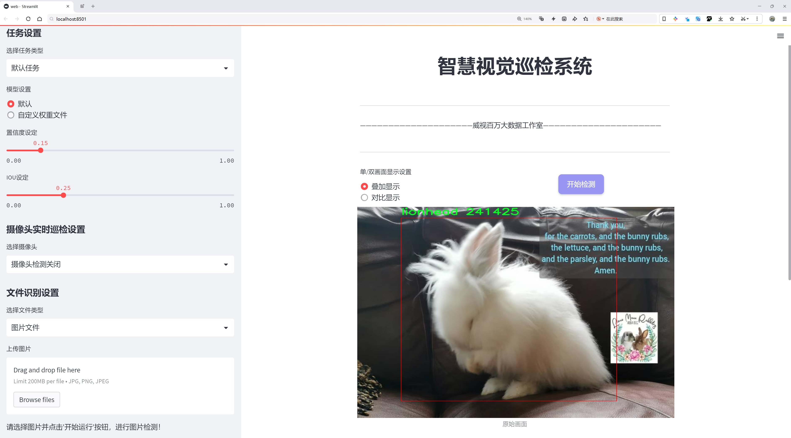
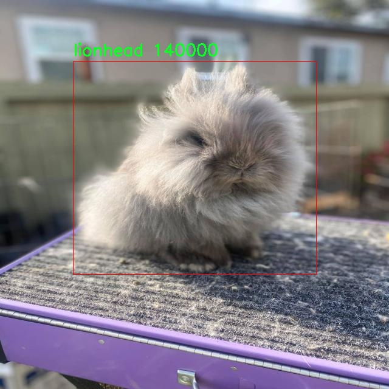
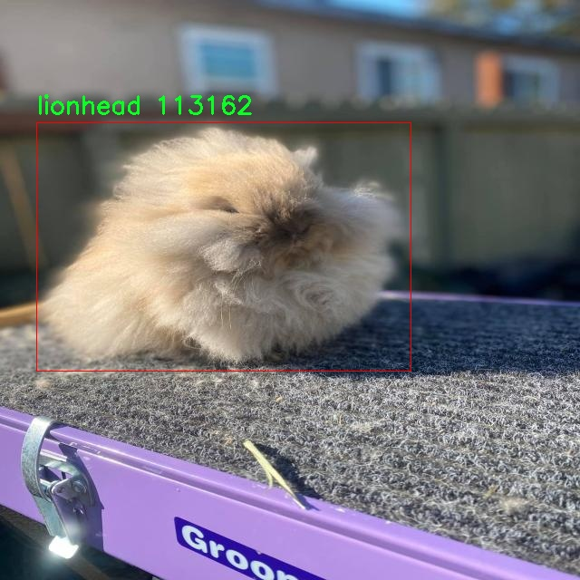
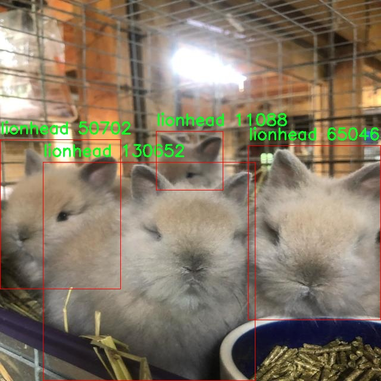
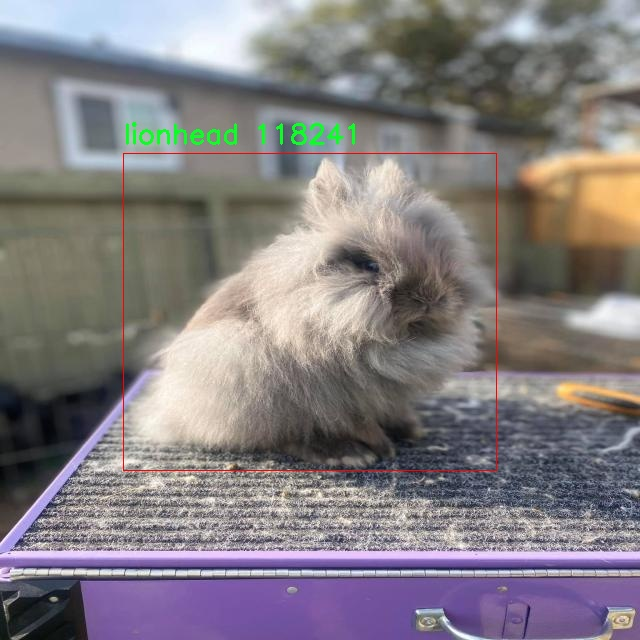
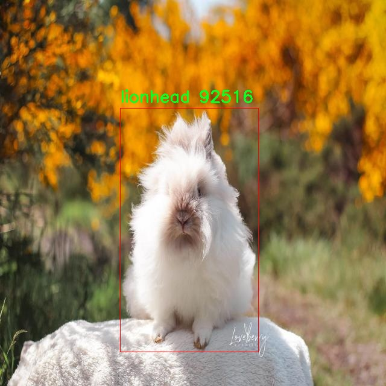

# 兔子检测检测系统源码分享
 # [一条龙教学YOLOV8标注好的数据集一键训练_70+全套改进创新点发刊_Web前端展示]

### 1.研究背景与意义

项目参考[AAAI Association for the Advancement of Artificial Intelligence](https://gitee.com/qunshansj/projects)

项目来源[AACV Association for the Advancement of Computer Vision](https://gitee.com/qunmasj/projects)

研究背景与意义

随着计算机视觉技术的快速发展，物体检测在多个领域中得到了广泛应用，包括自动驾驶、安防监控、农业监测等。尤其是在动物识别和监测方面，物体检测技术的应用潜力巨大。兔子作为一种重要的实验动物和经济动物，其种类繁多，尤其是狮头兔（lionhead rabbit）因其独特的外观和性格受到广泛喜爱。然而，传统的兔子检测方法往往依赖于人工识别，不仅效率低下，而且容易受到人为因素的影响，导致识别准确率低。因此，基于深度学习的自动化兔子检测系统的研究显得尤为重要。

YOLO（You Only Look Once）系列模型因其高效的实时检测能力而受到广泛关注。YOLOv8作为该系列的最新版本，在精度和速度上都有了显著提升。通过改进YOLOv8模型，我们可以针对特定的兔子种类进行更为精准的检测，尤其是狮头兔这一特定类别。我们的研究将利用包含2200张狮头兔图像的数据集进行模型训练与测试，这一数据集不仅数量可观，而且为模型提供了丰富的样本，有助于提高检测的准确性和鲁棒性。

本研究的意义在于，通过改进YOLOv8模型，我们可以实现对狮头兔的高效、准确检测，进而推动动物监测技术的发展。首先，改进后的检测系统能够在不同环境下快速识别狮头兔，帮助科研人员和养殖户实时监控兔子的活动状态，及时发现潜在问题。其次，该系统的应用将为动物保护和管理提供科学依据，促进兔子种群的可持续发展。此外，基于YOLOv8的兔子检测系统还可以为其他动物的检测提供借鉴，推动计算机视觉技术在动物识别领域的进一步应用。

此外，随着数据科学和人工智能技术的不断进步，如何有效利用数据集中的信息进行模型训练和优化成为研究的关键。我们将探索数据增强、迁移学习等技术，以提高模型在狮头兔检测中的表现。这不仅有助于提升检测系统的性能，也为后续的研究提供了新的思路和方法。

综上所述，基于改进YOLOv8的兔子检测系统的研究具有重要的理论价值和实际意义。它不仅为动物监测提供了新的技术手段，也为相关领域的研究提供了新的视角和方法。通过这一研究，我们期望能够推动兔子检测技术的发展，为动物保护和管理贡献一份力量。

### 2.图片演示







##### 注意：由于此博客编辑较早，上面“2.图片演示”和“3.视频演示”展示的系统图片或者视频可能为老版本，新版本在老版本的基础上升级如下：（实际效果以升级的新版本为准）

  （1）适配了YOLOV8的“目标检测”模型和“实例分割”模型，通过加载相应的权重（.pt）文件即可自适应加载模型。

  （2）支持“图片识别”、“视频识别”、“摄像头实时识别”三种识别模式。

  （3）支持“图片识别”、“视频识别”、“摄像头实时识别”三种识别结果保存导出，解决手动导出（容易卡顿出现爆内存）存在的问题，识别完自动保存结果并导出到tempDir中。

  （4）支持Web前端系统中的标题、背景图等自定义修改，后面提供修改教程。

  另外本项目提供训练的数据集和训练教程,暂不提供权重文件（best.pt）,需要您按照教程进行训练后实现图片演示和Web前端界面演示的效果。

### 3.视频演示

[3.1 视频演示](https://www.bilibili.com/video/BV1xHtpeNEPC/)

### 4.数据集信息展示

##### 4.1 本项目数据集详细数据（类别数＆类别名）

nc: 1
names: ['lionhead']


##### 4.2 本项目数据集信息介绍

数据集信息展示

在本研究中，我们采用了名为“lionhead rabbits”的数据集，以支持对YOLOv8模型的改进，专注于兔子检测系统的训练与优化。该数据集专门针对狮头兔（lionhead rabbit）这一特定品种，旨在提高计算机视觉系统在兔子识别和分类方面的准确性和效率。狮头兔因其独特的外观特征和温顺的性格而受到广泛喜爱，因此在宠物市场中占有重要地位。然而，现有的兔子检测系统在识别特定品种时常常面临挑战，这为本研究提供了重要的切入点。

“lionhead rabbits”数据集的类别数量为1，专注于狮头兔这一单一类别。这样的设计使得数据集能够深入挖掘狮头兔的特征，从而为模型提供更为精准的训练样本。通过聚焦于狮头兔，研究团队能够收集和标注大量相关图像，这些图像涵盖了不同的环境、姿态和光照条件，以确保模型在多样化场景下的鲁棒性和适应性。数据集中的图像不仅包括狮头兔的正面、侧面和背面视角，还涵盖了不同年龄段和体型的兔子，以便模型能够学习到更加全面的特征表示。

在数据集的构建过程中，研究团队采用了严格的图像采集和标注流程。每张图像都经过精心挑选和处理，确保其质量和标注的准确性。标注过程中，研究人员对每一张图像中的狮头兔进行了细致的框选，确保模型在训练时能够获得准确的位置信息。这种高质量的标注为后续的模型训练提供了坚实的基础，使得YOLOv8能够在检测任务中实现更高的精度。

为了进一步增强数据集的多样性，研究团队还考虑了数据增强技术的应用。通过对原始图像进行旋转、缩放、翻转等处理，数据集的有效样本数量得以显著增加。这不仅提升了模型的泛化能力，还减少了过拟合的风险，使得最终的检测系统在面对真实世界中的复杂场景时能够表现得更加出色。

此外，数据集的设计还考虑到了实际应用中的需求。随着宠物行业的不断发展，兔子作为宠物的受欢迎程度逐渐上升，相关的检测和管理需求也随之增加。因此，基于“lionhead rabbits”数据集训练的检测系统，能够为宠物店、动物收容所以及家庭养兔者提供有效的支持，帮助他们更好地识别和管理狮头兔。

综上所述，“lionhead rabbits”数据集为本研究提供了一个理想的基础，助力于改进YOLOv8模型在兔子检测任务中的表现。通过专注于狮头兔这一特定类别，结合高质量的图像和精确的标注，研究团队期望能够开发出一个高效、准确的兔子检测系统，为相关领域的应用提供切实的解决方案。











### 5.全套项目环境部署视频教程（零基础手把手教学）

[5.1 环境部署教程链接（零基础手把手教学）](https://www.ixigua.com/7404473917358506534?logTag=c807d0cbc21c0ef59de5)


[5.2 安装Python虚拟环境创建和依赖库安装视频教程链接（零基础手把手教学）](https://www.ixigua.com/7404474678003106304?logTag=1f1041108cd1f708b01a)

### 6.手把手YOLOV8训练视频教程（零基础小白有手就能学会）

[6.1 手把手YOLOV8训练视频教程（零基础小白有手就能学会）](https://www.ixigua.com/7404477157818401292?logTag=d31a2dfd1983c9668658)

### 7.70+种全套YOLOV8创新点代码加载调参视频教程（一键加载写好的改进模型的配置文件）

[7.1 70+种全套YOLOV8创新点代码加载调参视频教程（一键加载写好的改进模型的配置文件）](https://www.ixigua.com/7404478314661806627?logTag=29066f8288e3f4eea3a4)

### 8.70+种全套YOLOV8创新点原理讲解（非科班也可以轻松写刊发刊，V10版本正在科研待更新）

由于篇幅限制，每个创新点的具体原理讲解就不一一展开，具体见下列网址中的创新点对应子项目的技术原理博客网址【Blog】：


[8.1 70+种全套YOLOV8创新点原理讲解链接](https://gitee.com/qunmasj/good)

### 9.系统功能展示（检测对象为举例，实际内容以本项目数据集为准）

图9.1.系统支持检测结果表格显示

  图9.2.系统支持置信度和IOU阈值手动调节

  图9.3.系统支持自定义加载权重文件best.pt(需要你通过步骤5中训练获得)

  图9.4.系统支持摄像头实时识别

  图9.5.系统支持图片识别

  图9.6.系统支持视频识别

  图9.7.系统支持识别结果文件自动保存

  图9.8.系统支持Excel导出检测结果数据


### 10.原始YOLOV8算法原理

原始YOLOv8算法原理

YOLOv8是目标检测领域的一项重要进展，作为YOLO系列的最新版本，它在多个方面进行了创新和优化，使其在精度和速度上均表现出色。自2015年YOLO模型首次提出以来，经过多个版本的迭代，YOLOv8在保持高效性的同时，进一步提升了模型的可用性和灵活性。其结构主要由Backbone、Neck和Head三部分组成，分别负责特征提取、特征融合和目标检测输出。

在Backbone部分，YOLOv8延续了YOLOv5的CSPDarknet设计理念，但对其进行了改进，采用了C2f模块替代了C3模块。这一变化不仅实现了模型的轻量化，还在特征提取的精度上没有妥协。C2f模块的设计灵感来源于YOLOv7的ELAN结构，具有两个分支的特性，使得特征提取过程中的梯度流动更加顺畅，进而缓解了深层网络中的梯度消失问题。C2f模块通过将特征图分为两个分支进行处理，能够有效地捕捉到不同层次的特征信息，并在最终输出时进行融合，确保了模型在多尺度特征提取上的能力。

Neck部分采用了PAN-FPN结构，这一设计旨在充分融合不同层次的特征信息。通过自下而上的高层特征与中层、浅层特征的融合，YOLOv8能够更好地捕捉到目标的细节信息和语义信息。Neck结构中的特征融合不仅提高了模型对小目标的检测能力，还增强了对复杂场景的适应性。YOLOv8在这一部分的设计上进行了创新，去除了YOLOv5中上采样阶段的1x1卷积，直接将高层特征进行上采样并与中层特征进行连接，确保了特征信息的连续性和完整性。

在Head部分，YOLOv8引入了Anchor-Free的检测思想，摒弃了传统的Anchor-Base方法。这一转变使得模型在处理目标时更加灵活，尤其是在面对不同尺寸和形状的目标时，能够有效减少先验框的设置带来的局限性。YOLOv8的Head结构设计借鉴了YOLOX和YOLOv6的解耦头，采用了二阶段FCOS目标检测网络的设计，分类和回归分支被解耦处理，从而提高了检测的精度和效率。

在损失函数的设计上，YOLOv8使用了VFLLoss作为分类损失，并结合DFLLoss和CIoULoss作为回归损失。这种组合不仅提高了模型在复杂场景下的分类精度，还增强了对目标边界框的回归能力。特别是在处理样本不平衡问题时，YOLOv8通过FocalLoss的引入，能够有效地聚焦于难以分类的样本，提升了模型的整体性能。

为了进一步提升训练效果，YOLOv8在数据预处理阶段采用了多种增强手段，包括马赛克增强、混合增强、空间扰动和颜色扰动等。这些增强策略的应用，不仅丰富了训练样本的多样性，还提高了模型的泛化能力，使其在实际应用中表现更加稳健。

YOLOv8的设计理念充分考虑了实时检测的需求，通过优化网络结构和损失函数，达到了高效的推理速度和卓越的检测精度。其在硬件支持方面的广泛兼容性，使得YOLOv8能够在多种设备上运行，极大地拓宽了其应用场景。

总的来说，YOLOv8在原有YOLO系列的基础上，通过引入新颖的网络结构和优化策略，进一步提升了目标检测的性能。其高效的特征提取、灵活的特征融合和精准的目标检测能力，使得YOLOv8成为当前目标检测领域的一个重要里程碑，预示着未来在自动化和智能化应用中的广泛前景。无论是在工业检测、自动驾驶还是智能监控等领域，YOLOv8都展现出了强大的应用潜力，为相关技术的发展提供了新的动力。


### 11.项目核心源码讲解（再也不用担心看不懂代码逻辑）

#### 11.1 code\ultralytics\trackers\utils\gmc.py

以下是经过精简和注释的代码，保留了最核心的部分，并对每个重要的部分进行了详细的中文注释：

```python
import copy
import cv2
import numpy as np
from ultralytics.utils import LOGGER

class GMC:
    """
    通用运动补偿 (GMC) 类，用于视频帧中的跟踪和物体检测。

    该类提供了基于多种跟踪算法（包括 ORB、SIFT、ECC 和稀疏光流）的物体跟踪和检测方法。
    还支持对帧进行下采样以提高计算效率。
    """

    def __init__(self, method: str = "sparseOptFlow", downscale: int = 2) -> None:
        """
        初始化视频跟踪器，指定跟踪方法和下采样因子。

        参数:
            method (str): 用于跟踪的方法，包括 'orb', 'sift', 'ecc', 'sparseOptFlow', 'none'。
            downscale (int): 处理帧的下采样因子。
        """
        self.method = method
        self.downscale = max(1, int(downscale))

        # 根据选择的方法初始化相应的检测器和匹配器
        if self.method == "orb":
            self.detector = cv2.FastFeatureDetector_create(20)
            self.extractor = cv2.ORB_create()
            self.matcher = cv2.BFMatcher(cv2.NORM_HAMMING)
        elif self.method == "sift":
            self.detector = cv2.SIFT_create()
            self.extractor = cv2.SIFT_create()
            self.matcher = cv2.BFMatcher(cv2.NORM_L2)
        elif self.method == "ecc":
            self.warp_mode = cv2.MOTION_EUCLIDEAN
            self.criteria = (cv2.TERM_CRITERIA_EPS | cv2.TERM_CRITERIA_COUNT, 5000, 1e-6)
        elif self.method == "sparseOptFlow":
            self.feature_params = dict(maxCorners=1000, qualityLevel=0.01, minDistance=1, blockSize=3)
        elif self.method in {"none", "None", None}:
            self.method = None
        else:
            raise ValueError(f"错误: 未知的 GMC 方法: {method}")

        # 初始化参数
        self.prevFrame = None
        self.prevKeyPoints = None
        self.prevDescriptors = None
        self.initializedFirstFrame = False

    def apply(self, raw_frame: np.array) -> np.array:
        """
        使用指定的方法对原始帧进行物体检测。

        参数:
            raw_frame (np.array): 要处理的原始帧。

        返回:
            (np.array): 处理后的帧。
        """
        if self.method in ["orb", "sift"]:
            return self.applyFeatures(raw_frame)
        elif self.method == "ecc":
            return self.applyEcc(raw_frame)
        elif self.method == "sparseOptFlow":
            return self.applySparseOptFlow(raw_frame)
        else:
            return np.eye(2, 3)

    def applyEcc(self, raw_frame: np.array) -> np.array:
        """
        对原始帧应用 ECC 算法。

        参数:
            raw_frame (np.array): 要处理的原始帧。

        返回:
            (np.array): 处理后的帧。
        """
        height, width, _ = raw_frame.shape
        frame = cv2.cvtColor(raw_frame, cv2.COLOR_BGR2GRAY)
        H = np.eye(2, 3)

        # 对图像进行下采样
        if self.downscale > 1.0:
            frame = cv2.resize(frame, (width // self.downscale, height // self.downscale))

        # 处理第一帧
        if not self.initializedFirstFrame:
            self.prevFrame = frame.copy()
            self.initializedFirstFrame = True
            return H

        # 运行 ECC 算法
        try:
            (cc, H) = cv2.findTransformECC(self.prevFrame, frame, H, self.warp_mode, self.criteria)
        except Exception as e:
            LOGGER.warning(f"警告: 找到变换失败，设置为单位矩阵 {e}")

        return H

    def applyFeatures(self, raw_frame: np.array) -> np.array:
        """
        对原始帧应用基于特征的方法（如 ORB 或 SIFT）。

        参数:
            raw_frame (np.array): 要处理的原始帧。

        返回:
            (np.array): 处理后的帧。
        """
        height, width, _ = raw_frame.shape
        frame = cv2.cvtColor(raw_frame, cv2.COLOR_BGR2GRAY)
        H = np.eye(2, 3)

        # 对图像进行下采样
        if self.downscale > 1.0:
            frame = cv2.resize(frame, (width // self.downscale, height // self.downscale))

        # 检测关键点
        keypoints = self.detector.detect(frame)

        # 处理第一帧
        if not self.initializedFirstFrame:
            self.prevFrame = frame.copy()
            self.prevKeyPoints = copy.copy(keypoints)
            self.initializedFirstFrame = True
            return H

        # 匹配描述符
        knnMatches = self.matcher.knnMatch(self.prevDescriptors, keypoints, 2)

        # 过滤匹配
        goodMatches = [m for m, n in knnMatches if m.distance < 0.75 * n.distance]

        # 计算刚性矩阵
        if len(goodMatches) > 4:
            prevPoints = np.array([self.prevKeyPoints[m.queryIdx].pt for m in goodMatches])
            currPoints = np.array([keypoints[m.trainIdx].pt for m in goodMatches])
            H, _ = cv2.estimateAffinePartial2D(prevPoints, currPoints, cv2.RANSAC)

        self.prevFrame = frame.copy()
        self.prevKeyPoints = copy.copy(keypoints)

        return H

    def applySparseOptFlow(self, raw_frame: np.array) -> np.array:
        """
        对原始帧应用稀疏光流方法。

        参数:
            raw_frame (np.array): 要处理的原始帧。

        返回:
            (np.array): 处理后的帧。
        """
        height, width, _ = raw_frame.shape
        frame = cv2.cvtColor(raw_frame, cv2.COLOR_BGR2GRAY)
        H = np.eye(2, 3)

        # 对图像进行下采样
        if self.downscale > 1.0:
            frame = cv2.resize(frame, (width // self.downscale, height // self.downscale))

        # 检测关键点
        keypoints = cv2.goodFeaturesToTrack(frame, mask=None, **self.feature_params)

        # 处理第一帧
        if not self.initializedFirstFrame:
            self.prevFrame = frame.copy()
            self.prevKeyPoints = copy.copy(keypoints)
            self.initializedFirstFrame = True
            return H

        # 计算光流
        matchedKeypoints, status, _ = cv2.calcOpticalFlowPyrLK(self.prevFrame, frame, self.prevKeyPoints, None)

        # 过滤有效的匹配点
        prevPoints = np.array([self.prevKeyPoints[i] for i in range(len(status)) if status[i]])
        currPoints = np.array([matchedKeypoints[i] for i in range(len(status)) if status[i]])

        # 计算刚性矩阵
        if len(prevPoints) > 4:
            H, _ = cv2.estimateAffinePartial2D(prevPoints, currPoints, cv2.RANSAC)

        self.prevFrame = frame.copy()
        self.prevKeyPoints = copy.copy(keypoints)

        return H

    def reset_params(self) -> None:
        """重置参数。"""
        self.prevFrame = None
        self.prevKeyPoints = None
        self.prevDescriptors = None
        self.initializedFirstFrame = False
```

### 代码核心部分说明：
1. **类的初始化 (`__init__`)**：根据选择的跟踪方法初始化不同的检测器和匹配器，并设置一些基本参数。
2. **应用方法 (`apply`)**：根据选择的跟踪方法调用相应的处理函数。
3. **ECC 方法 (`applyEcc`)**：实现了基于增强相关性（ECC）的图像配准，处理第一帧并计算变换矩阵。
4. **特征方法 (`applyFeatures`)**：使用 ORB 或 SIFT 方法检测关键点，并计算匹配，进而估计刚性变换矩阵。
5. **稀疏光流方法 (`applySparseOptFlow`)**：使用稀疏光流方法计算关键点的运动，并估计变换矩阵。
6. **重置参数 (`reset_params`)**：用于重置跟踪器的状态，便于重新开始跟踪。

以上代码是对原始代码的核心部分进行了提炼和注释，保留了主要功能和逻辑。

这个文件定义了一个名为 `GMC` 的类，主要用于视频帧中的跟踪和物体检测。它实现了多种跟踪算法，包括 ORB、SIFT、ECC 和稀疏光流，并支持对帧进行下采样以提高计算效率。

在 `GMC` 类的构造函数中，用户可以指定所使用的跟踪方法和下采样因子。根据所选的方法，类会初始化相应的特征检测器、描述符提取器和匹配器。例如，如果选择 ORB 方法，类会创建一个 FAST 特征检测器和 ORB 描述符提取器；如果选择 SIFT 方法，则会创建 SIFT 特征检测器和描述符提取器；而对于 ECC 方法，则会设置相关的迭代次数和终止条件。

类的主要方法是 `apply`，它根据所选的方法处理输入的原始帧，并返回处理后的帧。具体来说，如果选择了 ORB 或 SIFT 方法，则调用 `applyFeatures` 方法；如果选择了 ECC 方法，则调用 `applyEcc` 方法；如果选择了稀疏光流方法，则调用 `applySparseOptFlow` 方法。

`applyEcc` 方法实现了对输入帧应用 ECC 算法的逻辑。它首先将帧转换为灰度图像，并在必要时进行下采样。然后，如果是处理第一帧，它会初始化前一帧并返回单位矩阵；否则，它会使用 `cv2.findTransformECC` 函数计算前一帧和当前帧之间的变换矩阵。

`applyFeatures` 方法则实现了基于特征的方法，如 ORB 或 SIFT。它同样将帧转换为灰度图像，并进行下采样。然后，它会根据提供的检测结果创建一个掩码，检测关键点并计算描述符。如果是第一帧，则会初始化前一帧、关键点和描述符；否则，它会通过匹配描述符来找到对应的关键点，并使用 RANSAC 方法估计刚性变换矩阵。

`applySparseOptFlow` 方法实现了稀疏光流的逻辑。它首先将帧转换为灰度图像并进行下采样，然后使用 `cv2.goodFeaturesToTrack` 函数检测关键点。如果是第一帧，则初始化相关数据；否则，它会计算前一帧和当前帧之间的光流，并根据匹配的关键点估计变换矩阵。

此外，类还提供了一个 `reset_params` 方法，用于重置所有参数，以便在需要时重新初始化跟踪器。

总体而言，这个类为视频处理中的物体跟踪提供了灵活的实现，允许用户根据需要选择不同的跟踪算法，并能够处理不同分辨率的帧。

#### 11.2 70+种YOLOv8算法改进源码大全和调试加载训练教程（非必要）\ultralytics\data\augment.py

以下是经过简化和注释的核心代码部分，主要包括图像增强和转换的相关类。注释详细解释了每个类和方法的功能及其参数。

```python
import random
import numpy as np
import cv2

class BaseTransform:
    """
    图像转换的基础类，提供了应用于图像和标签的基本方法。
    """

    def __init__(self) -> None:
        """初始化基础转换对象。"""
        pass

    def apply_image(self, labels):
        """应用图像转换到标签。"""
        pass

    def apply_instances(self, labels):
        """应用转换到标签中的对象实例。"""
        pass

    def apply_semantic(self, labels):
        """应用语义分割到图像。"""
        pass

    def __call__(self, labels):
        """应用所有标签转换到图像、实例和语义掩码。"""
        self.apply_image(labels)
        self.apply_instances(labels)
        self.apply_semantic(labels)


class Compose:
    """
    组合多个图像转换的类。
    """

    def __init__(self, transforms):
        """初始化组合对象，接收转换列表。"""
        self.transforms = transforms

    def __call__(self, data):
        """对输入数据应用一系列转换。"""
        for t in self.transforms:
            data = t(data)
        return data


class RandomFlip:
    """
    随机水平或垂直翻转图像的类。
    """

    def __init__(self, p=0.5, direction='horizontal') -> None:
        """
        初始化随机翻转类。

        参数:
            p (float): 翻转的概率，范围在0到1之间。
            direction (str): 翻转方向，支持'horizontal'或'vertical'。
        """
        assert direction in ['horizontal', 'vertical'], f'方向必须为`horizontal`或`vertical`，但得到了{direction}'
        assert 0 <= p <= 1.0
        self.p = p
        self.direction = direction

    def __call__(self, labels):
        """
        对图像应用随机翻转，并相应更新实例（如边界框、关键点等）。

        参数:
            labels (dict): 包含图像和实例的字典。

        返回:
            dict: 更新后的字典，包含翻转后的图像和更新的实例。
        """
        img = labels['img']
        if self.direction == 'vertical' and random.random() < self.p:
            img = np.flipud(img)  # 垂直翻转
        if self.direction == 'horizontal' and random.random() < self.p:
            img = np.fliplr(img)  # 水平翻转
        labels['img'] = img
        return labels


class LetterBox:
    """
    图像的LetterBox调整类，用于调整图像大小并添加边框。
    """

    def __init__(self, new_shape=(640, 640), auto=False):
        """初始化LetterBox对象，设置目标形状和自动调整标志。"""
        self.new_shape = new_shape
        self.auto = auto

    def __call__(self, labels=None, image=None):
        """返回更新后的标签和图像，添加边框。"""
        img = labels.get('img') if image is None else image
        shape = img.shape[:2]  # 当前形状 [高度, 宽度]
        r = min(self.new_shape[0] / shape[0], self.new_shape[1] / shape[1])  # 缩放比例
        new_unpad = int(round(shape[1] * r)), int(round(shape[0] * r))  # 新的未填充尺寸
        dw, dh = self.new_shape[1] - new_unpad[0], self.new_shape[0] - new_unpad[1]  # 填充尺寸

        # 计算填充
        dw, dh = dw / 2, dh / 2  # 将填充分配到两侧
        img = cv2.resize(img, new_unpad, interpolation=cv2.INTER_LINEAR)  # 调整图像大小
        img = cv2.copyMakeBorder(img, int(round(dh)), int(round(dh)), int(round(dw)), int(round(dw)), 
                                  cv2.BORDER_CONSTANT, value=(114, 114, 114))  # 添加边框
        labels['img'] = img
        return labels


class RandomHSV:
    """
    随机调整图像的HSV（色相、饱和度、明度）通道的类。
    """

    def __init__(self, hgain=0.5, sgain=0.5, vgain=0.5) -> None:
        """初始化RandomHSV类，设置每个HSV通道的增益。"""
        self.hgain = hgain
        self.sgain = sgain
        self.vgain = vgain

    def __call__(self, labels):
        """对图像应用随机HSV增强。"""
        img = labels['img']
        if self.hgain or self.sgain or self.vgain:
            r = np.random.uniform(-1, 1, 3) * [self.hgain, self.sgain, self.vgain] + 1  # 随机增益
            img_hsv = cv2.cvtColor(img, cv2.COLOR_BGR2HSV)
            img_hsv[..., 0] = (img_hsv[..., 0] * r[0]) % 180  # 色相调整
            img_hsv[..., 1] = np.clip(img_hsv[..., 1] * r[1], 0, 255)  # 饱和度调整
            img_hsv[..., 2] = np.clip(img_hsv[..., 2] * r[2], 0, 255)  # 明度调整
            img = cv2.cvtColor(img_hsv, cv2.COLOR_HSV2BGR)  # 转回BGR
        labels['img'] = img
        return labels
```

### 代码说明：
1. **BaseTransform**: 基础转换类，定义了图像转换的基本接口。
2. **Compose**: 用于组合多个转换的类，按顺序应用转换。
3. **RandomFlip**: 随机翻转图像的类，支持水平和垂直翻转。
4. **LetterBox**: 调整图像大小并添加边框的类，适用于目标检测。
5. **RandomHSV**: 随机调整图像的HSV通道的类，用于增强图像的色彩。

这些类和方法可以用于数据增强，以提高模型的鲁棒性和准确性。

这个文件是YOLOv8算法中的数据增强模块，主要用于对图像进行各种变换，以提高模型的鲁棒性和泛化能力。代码中定义了多个类，每个类负责不同的图像增强操作。

首先，`BaseTransform`类是一个基类，提供了基本的图像变换方法，包括对图像、实例和语义分割的处理。它的`__call__`方法会依次调用这些变换。

`Compose`类用于将多个变换组合在一起，允许用户按顺序应用一系列变换。它提供了添加新变换和将变换列表转换为标准Python列表的方法。

`BaseMixTransform`类是一个基础类，用于实现混合增强（如MixUp和Mosaic）。它的`__call__`方法会获取其他图像的信息，并应用混合变换。

`Mosaic`类继承自`BaseMixTransform`，实现了马赛克增强，通过将多个图像合并为一个马赛克图像来增强数据。该类允许用户指定马赛克的概率和大小。

`MixUp`类同样继承自`BaseMixTransform`，实现了MixUp增强，它通过将两张图像混合在一起，生成新的图像和标签。

`RandomPerspective`类实现了随机透视变换和仿射变换，能够对图像及其对应的边界框、分割和关键点进行变换。它支持旋转、平移、缩放和剪切等操作。

`RandomHSV`类负责对图像的HSV通道进行随机调整，以增加色彩的多样性。

`RandomFlip`类用于随机水平或垂直翻转图像，并相应地更新实例（如边界框和关键点）。

`LetterBox`类用于调整图像大小并添加边框，以适应YOLO模型的输入要求。

`CopyPaste`类实现了Copy-Paste增强，通过将实例从一张图像复制到另一张图像来增加数据的多样性。

`Albumentations`类提供了一系列额外的图像增强操作，使用了Albumentations库中的功能。

`Format`类用于格式化图像注释，以便在PyTorch的DataLoader中使用。

最后，`v8_transforms`函数定义了一系列针对YOLOv8训练的图像转换操作，结合了上述的多个增强类，以便在训练过程中对图像进行有效的预处理和增强。

整体来看，这个文件的主要目的是提供多种数据增强方法，以便在训练YOLOv8模型时提高模型的性能和鲁棒性。通过组合不同的增强策略，可以生成多样化的训练样本，从而使模型在面对不同场景和条件时更具适应性。

#### 11.3 ui.py

```python
import sys
import subprocess

def run_script(script_path):
    """
    使用当前 Python 环境运行指定的脚本。

    Args:
        script_path (str): 要运行的脚本路径

    Returns:
        None
    """
    # 获取当前 Python 解释器的路径
    python_path = sys.executable

    # 构建运行命令，使用 streamlit 运行指定的脚本
    command = f'"{python_path}" -m streamlit run "{script_path}"'

    # 执行命令
    result = subprocess.run(command, shell=True)
    # 检查命令执行的返回码，0 表示成功，非 0 表示出错
    if result.returncode != 0:
        print("脚本运行出错。")

# 主程序入口
if __name__ == "__main__":
    # 指定要运行的脚本路径
    script_path = "web.py"  # 这里可以直接指定脚本名称

    # 调用函数运行脚本
    run_script(script_path)
```

### 代码核心部分说明：
1. **导入模块**：
   - `sys`：用于获取当前 Python 解释器的路径。
   - `subprocess`：用于执行外部命令。

2. **`run_script` 函数**：
   - 接收一个参数 `script_path`，表示要运行的脚本路径。
   - 使用 `sys.executable` 获取当前 Python 解释器的路径。
   - 构建命令字符串，使用 `streamlit` 模块运行指定的脚本。
   - 使用 `subprocess.run` 执行命令，并检查返回码以判断脚本是否成功运行。

3. **主程序入口**：
   - 在 `if __name__ == "__main__":` 块中，指定要运行的脚本路径，并调用 `run_script` 函数。

这个程序文件名为 `ui.py`，主要功能是使用当前的 Python 环境来运行一个指定的脚本，具体是一个名为 `web.py` 的文件。程序首先导入了必要的模块，包括 `sys`、`os` 和 `subprocess`，以及一个自定义的路径处理模块 `abs_path`。

在 `run_script` 函数中，首先获取当前 Python 解释器的路径，使用 `sys.executable` 来实现。接着，构建一个命令字符串，这个命令将使用 Streamlit 框架来运行指定的脚本。命令的格式是 `"{python_path}" -m streamlit run "{script_path}"`，其中 `python_path` 是当前 Python 解释器的路径，`script_path` 是要运行的脚本路径。

然后，使用 `subprocess.run` 方法来执行这个命令。这个方法会在一个新的 shell 中运行命令，并等待其完成。如果脚本运行的返回码不为零，表示运行过程中出现了错误，程序会打印出“脚本运行出错。”的提示信息。

在文件的最后部分，使用 `if __name__ == "__main__":` 语句来确保当该文件作为主程序运行时，才会执行以下代码。这里指定了要运行的脚本路径为 `web.py`，并调用 `run_script` 函数来执行这个脚本。

总的来说，这个程序的主要目的是为了方便地启动一个 Streamlit 应用，用户只需修改脚本路径即可运行不同的应用。

#### 11.4 70+种YOLOv8算法改进源码大全和调试加载训练教程（非必要）\ultralytics\models\yolo\segment\__init__.py

```python
# 导入必要的模块和类
# Ultralytics YOLO 🚀, AGPL-3.0 license

# 从当前包中导入SegmentationPredictor类，用于图像分割的预测
from .predict import SegmentationPredictor

# 从当前包中导入SegmentationTrainer类，用于训练图像分割模型
from .train import SegmentationTrainer

# 从当前包中导入SegmentationValidator类，用于验证图像分割模型的性能
from .val import SegmentationValidator

# 定义当前模块的公开接口，允许外部访问这三个类
__all__ = 'SegmentationPredictor', 'SegmentationTrainer', 'SegmentationValidator'
```

### 代码注释说明：
1. **导入模块**：代码首先导入了三个类，分别用于图像分割的预测、训练和验证。这些类的功能是实现YOLO（You Only Look Once）模型在图像分割任务中的应用。
   
2. **`__all__` 变量**：这个变量定义了模块的公共接口，指定了哪些类可以被外部访问。这样做的目的是为了控制模块的命名空间，避免不必要的类被导入，确保使用者只接触到必要的部分。

这个程序文件是一个Python模块的初始化文件，属于Ultralytics YOLO项目的一部分，主要用于目标检测和分割任务。文件的主要功能是导入和定义该模块中可用的类或函数。

首先，文件顶部的注释说明了该项目是Ultralytics YOLO的实现，并且使用AGPL-3.0许可证，这意味着该代码是开源的，用户可以自由使用和修改，但需要遵循相应的许可证条款。

接下来，文件通过相对导入的方式引入了三个重要的类：`SegmentationPredictor`、`SegmentationTrainer`和`SegmentationValidator`。这些类分别用于图像分割的预测、训练和验证。具体来说：

- `SegmentationPredictor`类负责执行图像分割的预测任务，能够对输入的图像进行处理并输出分割结果。
- `SegmentationTrainer`类用于训练模型，提供了训练过程中的各种功能和参数设置，以便用户能够根据自己的数据集进行模型训练。
- `SegmentationValidator`类则用于验证训练好的模型，评估其在验证集上的表现，以确保模型的有效性和准确性。

最后，`__all__`变量定义了该模块中可以被外部导入的类的名称。通过这种方式，用户在使用`from module import *`时，只会导入`SegmentationPredictor`、`SegmentationTrainer`和`SegmentationValidator`这三个类，避免了不必要的命名冲突和混乱。

总的来说，这个初始化文件为YOLOv8的分割功能提供了基础结构，方便用户进行图像分割任务的预测、训练和验证。

#### 11.5 code\ultralytics\utils\__init__.py

以下是代码中最核心的部分，并附上详细的中文注释：

```python
import os
import platform
import logging
from pathlib import Path
import torch
import yaml

# 设置 PyTorch 的打印选项
torch.set_printoptions(linewidth=320, precision=4, profile="default")

# 定义根目录和配置文件路径
FILE = Path(__file__).resolve()  # 当前文件的绝对路径
ROOT = FILE.parents[1]  # 根目录，假设当前文件在 utils 目录下
DEFAULT_CFG_PATH = ROOT / "cfg/default.yaml"  # 默认配置文件路径

# 日志设置
LOGGING_NAME = "ultralytics"  # 日志名称
def set_logging(name=LOGGING_NAME, verbose=True):
    """设置日志记录，支持 UTF-8 编码。"""
    level = logging.INFO if verbose else logging.ERROR  # 根据 verbose 设置日志级别
    formatter = logging.Formatter("%(message)s")  # 日志格式
    stream_handler = logging.StreamHandler()  # 创建流处理器
    stream_handler.setFormatter(formatter)  # 设置格式
    logger = logging.getLogger(name)  # 获取日志记录器
    logger.setLevel(level)  # 设置日志级别
    logger.addHandler(stream_handler)  # 添加处理器
    logger.propagate = False  # 不传播日志
    return logger

# 设置全局日志记录器
LOGGER = set_logging(LOGGING_NAME, verbose=True)

# YAML 文件读写函数
def yaml_save(file="data.yaml", data=None, header=""):
    """将数据保存为 YAML 格式的文件。"""
    if data is None:
        data = {}
    file = Path(file)  # 转换为 Path 对象
    if not file.parent.exists():
        file.parent.mkdir(parents=True, exist_ok=True)  # 创建父目录

    # 将数据写入 YAML 文件
    with open(file, "w", errors="ignore", encoding="utf-8") as f:
        if header:
            f.write(header)  # 写入头部信息
        yaml.safe_dump(data, f, sort_keys=False, allow_unicode=True)  # 保存数据

def yaml_load(file="data.yaml"):
    """从 YAML 文件加载数据。"""
    with open(file, errors="ignore", encoding="utf-8") as f:
        data = yaml.safe_load(f) or {}  # 加载数据，确保返回字典
    return data

# 默认配置加载
DEFAULT_CFG_DICT = yaml_load(DEFAULT_CFG_PATH)  # 从默认配置文件加载配置
DEFAULT_CFG = SimpleNamespace(**DEFAULT_CFG_DICT)  # 将配置转换为命名空间对象

# 检查操作系统类型
def is_ubuntu() -> bool:
    """检查当前操作系统是否为 Ubuntu。"""
    return platform.system() == "Linux" and os.path.exists("/etc/os-release") and "ID=ubuntu" in open("/etc/os-release").read()

# 检查网络连接
def is_online() -> bool:
    """检查是否在线。"""
    import socket
    try:
        socket.create_connection(("1.1.1.1", 53), timeout=2)  # 尝试连接到公共 DNS
        return True
    except OSError:
        return False

ONLINE = is_online()  # 检查当前是否在线

# 设置用户配置目录
def get_user_config_dir(sub_dir="Ultralytics"):
    """获取用户配置目录。"""
    if platform.system() == "Windows":
        path = Path.home() / "AppData" / "Roaming" / sub_dir
    elif platform.system() == "Darwin":  # macOS
        path = Path.home() / "Library" / "Application Support" / sub_dir
    else:  # Linux
        path = Path.home() / ".config" / sub_dir

    path.mkdir(parents=True, exist_ok=True)  # 创建目录
    return path

USER_CONFIG_DIR = get_user_config_dir()  # 获取用户配置目录
SETTINGS_YAML = USER_CONFIG_DIR / "settings.yaml"  # 设置 YAML 文件路径

# 设置默认配置
class SettingsManager(dict):
    """管理 Ultralytics 设置的类。"""
    def __init__(self, file=SETTINGS_YAML):
        """初始化设置管理器，加载和验证当前设置。"""
        self.file = Path(file)
        if not self.file.exists():
            self.save()  # 如果文件不存在，保存默认设置
        self.load()  # 加载设置

    def load(self):
        """从 YAML 文件加载设置。"""
        super().update(yaml_load(self.file))  # 更新当前设置

    def save(self):
        """保存当前设置到 YAML 文件。"""
        yaml_save(self.file, dict(self))  # 保存设置

SETTINGS = SettingsManager()  # 初始化设置管理器
```

### 代码核心部分说明：
1. **日志设置**：通过 `set_logging` 函数设置日志记录器，支持不同的日志级别和格式。
2. **YAML 文件读写**：定义了 `yaml_save` 和 `yaml_load` 函数，用于将数据保存为 YAML 格式文件和从 YAML 文件加载数据。
3. **默认配置加载**：从默认配置文件加载配置，并将其转换为命名空间对象以便于访问。
4. **操作系统和网络检查**：定义了函数检查当前操作系统是否为 Ubuntu，以及检查网络连接状态。
5. **用户配置目录**：获取用户配置目录并确保其存在。
6. **设置管理**：通过 `SettingsManager` 类管理 Ultralytics 的设置，支持加载和保存功能。

这个程序文件是Ultralytics YOLO（You Only Look Once）项目的一个工具模块，主要用于初始化和配置一些基本功能。文件中包含了多个功能和类的定义，以下是对代码的逐步讲解。

首先，文件导入了一系列必要的库，包括标准库和第三方库。标准库如`os`、`platform`、`logging`等用于系统操作、平台检测和日志记录，第三方库如`torch`、`cv2`、`yaml`等则用于深度学习、图像处理和配置文件的读写。

接下来，文件定义了一些常量，包括当前文件路径、根目录、默认配置路径、线程数等。这些常量在后续的代码中会被多次使用，以确保程序在不同环境下的兼容性和灵活性。

文件中还包含了一个帮助信息字符串`HELP_MSG`，提供了如何使用YOLOv8的示例，包括安装、使用Python SDK和命令行接口的示例。这为用户提供了快速入门的指导。

接着，文件设置了一些PyTorch和NumPy的打印选项，以及OpenCV的线程数，确保在多线程环境下的稳定性。

定义了一个自定义的`tqdm`类，用于进度条的显示，支持根据全局的详细模式进行调整。然后定义了一个`SimpleClass`类，提供了友好的字符串表示和属性访问方法，便于调试和使用。

`IterableSimpleNamespace`类是对`SimpleNamespace`的扩展，增加了可迭代功能，使得可以通过字典和循环来使用。

文件中还定义了一些与YAML文件操作相关的函数，如`yaml_save`和`yaml_load`，用于保存和加载YAML格式的数据。这些函数支持错误处理和文件路径的管理。

接下来，文件定义了一些环境检测函数，例如`is_ubuntu`、`is_colab`、`is_kaggle`等，用于判断当前脚本运行的环境。这些函数可以帮助程序根据不同的环境做出相应的调整。

此外，文件中还有一些与Git相关的函数，如`get_git_dir`、`get_git_origin_url`等，用于获取当前Git仓库的信息。

在文件的最后部分，程序会执行一些初始化操作，包括检查首次安装步骤、设置用户配置目录、应用猴子补丁等。这些操作确保了程序在启动时能够正确配置和运行。

总体来说，这个文件为Ultralytics YOLO项目提供了基础的工具和配置功能，帮助用户更方便地使用YOLO进行目标检测和其他计算机视觉任务。

#### 11.6 70+种YOLOv8算法改进源码大全和调试加载训练教程（非必要）\ultralytics\nn\modules\utils.py

以下是代码中最核心的部分，并附上详细的中文注释：

```python
import torch
import torch.nn.functional as F

def multi_scale_deformable_attn_pytorch(value: torch.Tensor, value_spatial_shapes: torch.Tensor,
                                        sampling_locations: torch.Tensor,
                                        attention_weights: torch.Tensor) -> torch.Tensor:
    """
    多尺度可变形注意力机制。

    参数:
        value: 输入特征图，形状为 (bs, C, num_heads, embed_dims)，
               其中 bs 是批量大小，C 是通道数，num_heads 是头数，embed_dims 是每个头的维度。
        value_spatial_shapes: 特征图的空间形状，形状为 (num_levels, 2)，
                              每一行表示一个特征图的高度和宽度。
        sampling_locations: 采样位置，形状为 (bs, num_queries, num_heads, num_levels, num_points, 2)，
                           表示每个查询的采样位置。
        attention_weights: 注意力权重，形状为 (bs, num_heads, num_queries, num_levels, num_points)。

    返回:
        output: 输出特征图，形状为 (bs, num_queries, num_heads * embed_dims)。
    """

    # 获取输入的维度信息
    bs, _, num_heads, embed_dims = value.shape  # 批量大小、通道数、头数、每个头的维度
    _, num_queries, _, num_levels, num_points, _ = sampling_locations.shape  # 查询数、特征图层数、每层的采样点数

    # 将输入特征图按照空间形状分割成多个特征图
    value_list = value.split([H_ * W_ for H_, W_ in value_spatial_shapes], dim=1)
    
    # 将采样位置转换到[-1, 1]的范围
    sampling_grids = 2 * sampling_locations - 1
    sampling_value_list = []

    # 遍历每个特征图层
    for level, (H_, W_) in enumerate(value_spatial_shapes):
        # 对特征图进行处理，将其形状调整为 (bs*num_heads, embed_dims, H_, W_)
        value_l_ = (value_list[level].flatten(2).transpose(1, 2).reshape(bs * num_heads, embed_dims, H_, W_))
        
        # 处理采样位置，将其形状调整为 (bs*num_heads, num_queries, num_points, 2)
        sampling_grid_l_ = sampling_grids[:, :, :, level].transpose(1, 2).flatten(0, 1)
        
        # 使用grid_sample进行双线性插值，获取采样值
        sampling_value_l_ = F.grid_sample(value_l_,
                                          sampling_grid_l_,
                                          mode='bilinear',
                                          padding_mode='zeros',
                                          align_corners=False)
        sampling_value_list.append(sampling_value_l_)

    # 将注意力权重的形状调整为 (bs*num_heads, 1, num_queries, num_levels*num_points)
    attention_weights = attention_weights.transpose(1, 2).reshape(bs * num_heads, 1, num_queries,
                                                                  num_levels * num_points)
    
    # 计算最终输出
    output = ((torch.stack(sampling_value_list, dim=-2).flatten(-2) * attention_weights).sum(-1).view(
        bs, num_heads * embed_dims, num_queries))
    
    return output.transpose(1, 2).contiguous()  # 返回形状为 (bs, num_queries, num_heads * embed_dims) 的输出
```

### 代码说明：
1. **多尺度可变形注意力机制**：该函数实现了多尺度的可变形注意力机制，主要用于处理不同尺度的特征图。
2. **输入参数**：
   - `value`：输入特征图，包含多个头的特征信息。
   - `value_spatial_shapes`：特征图的空间形状，提供每个特征图的高度和宽度。
   - `sampling_locations`：指定在特征图上采样的位置。
   - `attention_weights`：每个查询的注意力权重，控制不同采样点的影响力。
3. **输出**：函数返回经过注意力机制处理后的特征图，形状为 `(bs, num_queries, num_heads * embed_dims)`，即每个查询对应的特征表示。

这个程序文件是一个与YOLOv8算法相关的工具模块，主要用于实现一些深度学习模型中的常用功能。文件中包含了一些函数，这些函数主要用于模块的克隆、权重初始化、反sigmoid计算以及多尺度可变形注意力机制的实现。

首先，文件导入了一些必要的库，包括`copy`、`math`、`numpy`和`torch`等。接着，定义了一个辅助函数`_get_clones`，该函数用于根据给定的模块创建一个克隆模块的列表。这在深度学习中常用于创建多个相同的层，以便在模型中重复使用。

接下来，`bias_init_with_prob`函数用于根据给定的先验概率初始化卷积或全连接层的偏置值。它通过计算负对数几率来返回偏置的初始化值，这在处理二分类问题时非常有用。

`linear_init_`函数则是用于初始化线性模块的权重和偏置。它通过均匀分布在一定范围内初始化权重和偏置，以确保模型在训练初期的稳定性。

`inverse_sigmoid`函数实现了反sigmoid函数的计算。该函数对输入的张量进行限制，确保其值在0到1之间，然后计算其反sigmoid值。这在某些情况下可以用于调整模型的输出。

最后，`multi_scale_deformable_attn_pytorch`函数实现了多尺度可变形注意力机制。该函数接收多个输入，包括值张量、空间形状、采样位置和注意力权重。它通过对输入进行一系列变换和处理，计算出最终的输出。这个过程涉及到对输入进行分割、重塑、采样等操作，旨在增强模型对不同尺度特征的捕捉能力。

总体来说，这个文件提供了一些基础的工具函数和实现，旨在支持YOLOv8算法的训练和推理过程。通过这些工具，用户可以更方便地构建和调试深度学习模型。

### 12.系统整体结构（节选）

### 整体功能和构架概括

Ultralytics YOLO项目是一个开源的目标检测和图像分割框架，主要基于YOLOv8算法。该项目的整体功能包括数据处理、模型训练、推理、可视化以及结果评估等。项目的构架由多个模块组成，每个模块负责特定的功能，形成一个完整的工作流。

1. **数据处理**：包括数据增强、数据加载和预处理，确保输入数据的多样性和适应性。
2. **模型定义**：包括模型的构建、初始化和参数设置，支持多种网络结构和训练策略。
3. **训练与验证**：提供训练和验证的功能，能够根据用户的需求进行模型训练和评估。
4. **推理与可视化**：支持对新数据的推理，并提供可视化工具以展示检测结果。
5. **工具与实用功能**：包括各种实用工具函数、回调函数和环境检测，帮助用户更方便地使用和调试模型。

### 文件功能整理表

| 文件路径                                                                                     | 功能描述                                                         |
|--------------------------------------------------------------------------------------------|------------------------------------------------------------------|
| `code\ultralytics\trackers\utils\gmc.py`                                                  | 实现视频帧中的物体跟踪，支持多种跟踪算法（如ORB、SIFT等）。     |
| `70+种YOLOv8算法改进源码大全和调试加载训练教程（非必要）\ultralytics\data\augment.py`       | 提供多种数据增强方法，以提高模型的鲁棒性和泛化能力。             |
| `ui.py`                                                                                    | 启动Streamlit应用，用于可视化和交互式操作。                      |
| `70+种YOLOv8算法改进源码大全和调试加载训练教程（非必要）\ultralytics\models\yolo\segment\__init__.py` | 初始化分割模块，导入分割相关的类（如预测器、训练器、验证器）。   |
| `code\ultralytics\utils\__init__.py`                                                     | 提供基础工具和配置功能，支持环境检测、YAML文件操作等。            |
| `70+种YOLOv8算法改进源码大全和调试加载训练教程（非必要）\ultralytics\nn\modules\utils.py` | 实现深度学习模型的常用功能，如模块克隆、权重初始化和可变形注意力。 |
| `code\ultralytics\utils\callbacks\clearml.py`                                            | 提供与ClearML集成的回调功能，用于实验管理和监控。                |
| `70+种YOLOv8算法改进源码大全和调试加载训练教程（非必要）\ultralytics\models\fastsam\utils.py` | 实现FastSAM模型的相关工具和功能。                                |
| `train.py`                                                                                 | 训练YOLOv8模型的主程序，负责模型的训练过程和参数设置。           |
| `70+种YOLOv8算法改进源码大全和调试加载训练教程（非必要）\ultralytics\models\utils\ops.py` | 提供模型操作的工具函数，如卷积、激活等基本操作。                 |
| `code\ultralytics\data\base.py`                                                           | 定义数据集的基本类和数据加载功能。                               |
| `code\ultralytics\models\yolo\segment\train.py`                                          | 实现YOLOv8分割模型的训练逻辑。                                   |
| `code\ultralytics\utils\callbacks\wb.py`                                                 | 提供与Weights & Biases集成的回调功能，用于实验跟踪和可视化。     |

这个表格总结了各个文件的主要功能，帮助用户快速了解Ultralytics YOLO项目的结构和各个模块的作用。

注意：由于此博客编辑较早，上面“11.项目核心源码讲解（再也不用担心看不懂代码逻辑）”中部分代码可能会优化升级，仅供参考学习，完整“训练源码”、“Web前端界面”和“70+种创新点源码”以“13.完整训练+Web前端界面+70+种创新点源码、数据集获取”的内容为准。

### 13.完整训练+Web前端界面+70+种创新点源码、数据集获取


# [下载链接：https://mbd.pub/o/bread/ZpuXk5ht](https://mbd.pub/o/bread/ZpuXk5ht)